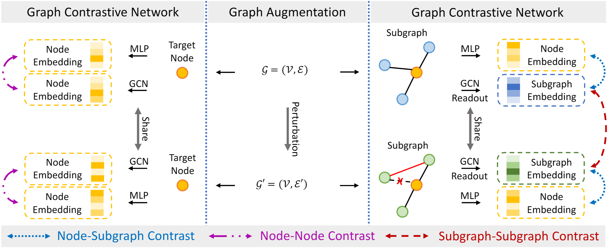

# Graph Anomaly Detection via Multi-Scale Contrastive Learning Networks with Augmented View

<p align="center">   
    <a href="https://pytorch.org/" alt="PyTorch">
      </a>
    <a href="https://aaai.org/Conferences/AAAI-23/" alt="Conference">
        </a>
<p/>
Pytorch implement of paper [Graph Anomaly Detection via Multi-Scale Contrastive Learning Networks with Augmented View](https://ojs.aaai.org/index.php/AAAI/article/view/25907) accepted by AAAI 2023.

An official source code for the paper: https://github.com/FelixDJC/GRADATE.

------


## Overview

<div  align="center">    
    
</div>


<div  align="center">    
    Figure 1: Overall framework of GRADATE.
</div>


## Requirements

This code requires the following:

- python==3.8

- torch==2.0.1

- dgl==0.4.3post2

- numpy==1.24.4

  

## Running the experiments

#### Step 1: Dataset Preparation and Anomaly Injection

Prepare the corresponding datasets. If the clean datasets downloaded from the official website or other datasets without anomalies, you need to manually run inject_anomaly.py to inject attribute and feature anomalies. Refer to the introduction of https://github.com/TrustAGI-Lab/CoLA.

#### Step 2: Anomaly Detection

This step is to run the framework to detect anomalies in the network datasets. Take Cora dataset as an example:

```
python run.py --dataset cora
```

The hyperparameters are set to be the values reported in the paper. 


## Citation

```
inproceedings{GRADATE,
  title={Graph anomaly detection via multi-scale contrastive learning networks with augmented view},
  author={Duan, Jingcan and Wang, Siwei and Zhang, Pei and Zhu, En and Hu, Jingtao and Jin, Hu and Liu, Yue and Dong, Zhibin},
  booktitle={Proceedings of the AAAI Conference on Artificial Intelligence},
  volume={37},
  number={6},
  pages={7459--7467},
  year={2023}
}
```
